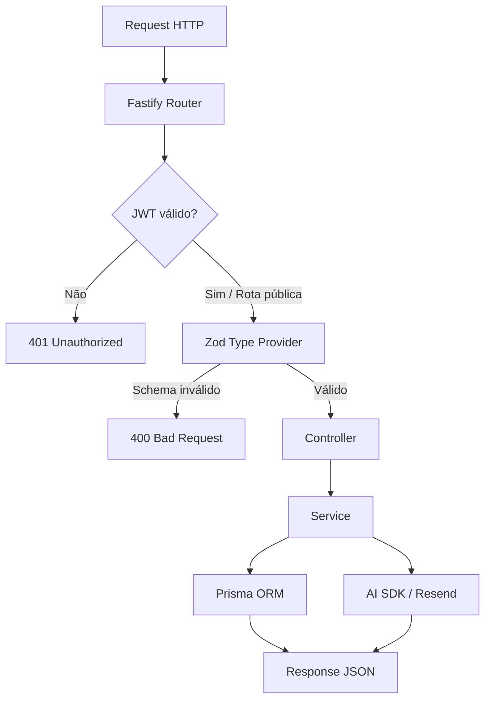

# ContrataJá — API

API RESTful construída com Fastify e TypeScript. Responsável por autenticação, gestão de vagas, análise de candidatos via IA, envio de e-mails e armazenamento de dados com Prisma/PostgreSQL.

---

## Arquitetura

```
Request → Fastify Router → JWT Middleware → Zod Validation → Controller → Service → Prisma / AI SDK
```

Fluxo detalhado:



---

## Tecnologias

| Pacote                       | Versão | Função                                         |
| ---------------------------- | ------ | ---------------------------------------------- |
| Fastify                      | 5.x    | Framework HTTP de alta performance             |
| TypeScript                   | 6.x    | Tipagem estática                               |
| Prisma ORM                   | 7.x    | Acesso ao banco e migrações                    |
| PostgreSQL                   | —      | Banco de dados relacional                      |
| Zod + fastify-type-provider  | —      | Validação de schemas em runtime                |
| Vercel AI SDK                | 6.x    | Abstração para Anthropic e OpenAI              |
| Resend                       | 6.x    | Envio de e-mails transacionais                 |
| bcryptjs + jsonwebtoken      | —      | Hash de senhas e geração/validação de JWT      |
| @fastify/helmet              | —      | Headers HTTP de segurança                      |
| @fastify/multipart           | —      | Upload de arquivos (PDF de currículos)         |

---

## Pré-requisitos

- Node.js 20 ou superior
- pnpm 9 ou superior
- PostgreSQL rodando (local ou Supabase)
- Chave de API da OpenAI **ou** Anthropic
- Chave de API do Resend (para envio de e-mails)

---

## Instalação

```bash
cd Backend
pnpm install
cp .env.example .env
```

Configure o `.env` (ver seção [Variáveis de ambiente](#variáveis-de-ambiente)), depois execute:

```bash
npx prisma migrate dev    # Cria as tabelas no banco
npx prisma generate       # Gera o Prisma Client tipado
```

---

## Rodando

```bash
# Desenvolvimento (hot-reload com tsx)
pnpm dev

# Produção
pnpm build && pnpm start
```

A API estará disponível em `http://localhost:3001`.

Para inspecionar o banco visualmente:

```bash
npx prisma studio   # http://localhost:5555
```

---

## Estrutura de diretórios

```
Backend/
├── prisma/
│   ├── schema.prisma          # Modelagem das entidades
│   ├── migrations/            # Histórico SQL de migrações
│   └── seed.ts                # Script de dados iniciais
├── src/
│   ├── Ai/
│   │   ├── Anthropic.ts       # Cliente Anthropic
│   │   └── OpenAi.ts          # Cliente OpenAI
│   ├── config/
│   │   └── env.ts             # Carregamento e validação das env vars
│   ├── controllers/           # Handlers das requisições HTTP
│   ├── middleware/            # Verificação de JWT e permissões
│   ├── Routes/                # Registro de rotas por domínio
│   ├── schemas/               # Schemas Zod reutilizáveis
│   ├── services/              # Lógica de negócio e queries Prisma
│   ├── app.ts                 # Inicialização do Fastify e plugins
│   └── server.ts              # Entry point (listen)
├── uploads/                   # Armazenamento temporário de PDFs
├── package.json
└── tsconfig.json
```

---

## Endpoints

Prefixo base: `/api`

### Autenticação

| Método | Rota             | Descrição                            | Auth    |
| ------ | ---------------- | ------------------------------------ | ------- |
| POST   | `/auth/register` | Cria empresa e administrador inicial | Público |
| POST   | `/auth/login`    | Autentica e retorna JWT              | Público |
| GET    | `/auth/me`       | Dados do usuário autenticado         | JWT     |

### Vagas

| Método | Rota                 | Descrição                              | Auth |
| ------ | -------------------- | -------------------------------------- | ---- |
| GET    | `/vagas`             | Lista vagas da empresa                 | JWT  |
| POST   | `/vagas`             | Cria nova vaga                         | JWT  |
| GET    | `/vagas/:id`         | Detalhes de uma vaga                   | JWT  |
| DELETE | `/vagas/:id`         | Remove uma vaga                        | JWT  |
| POST   | `/vagas/ai/generate` | Gera descrição via IA                  | JWT  |

### Candidatos

| Método | Rota                              | Descrição                                   | Auth    |
| ------ | --------------------------------- | ------------------------------------------- | ------- |
| GET    | `/candidatos/public-token/:token` | Valida token público e retorna dados da vaga | Público |
| POST   | `/candidatos`                     | Submete candidatura com currículo PDF        | Público |
| GET    | `/candidatos`                     | Lista candidatos da empresa                  | JWT     |
| POST   | `/candidatos/analyze/:id`         | Dispara análise de IA para o candidato       | JWT     |

### Organograma

| Método | Rota               | Descrição                     | Auth |
| ------ | ------------------ | ----------------------------- | ---- |
| GET    | `/organograma`     | Retorna hierarquia da empresa | JWT  |
| POST   | `/organograma`     | Adiciona nó                   | JWT  |
| PUT    | `/organograma/:id` | Atualiza nó                   | JWT  |
| DELETE | `/organograma/:id` | Remove nó                     | JWT  |

### E-mails

| Método | Rota           | Descrição                   | Auth |
| ------ | -------------- | --------------------------- | ---- |
| POST   | `/emails/send` | Envia e-mail via Resend SDK | JWT  |

---

## Variáveis de ambiente

| Variável            | Obrigatória | Descrição                                         | Exemplo                     |
| ------------------- | ----------- | ------------------------------------------------- | --------------------------- |
| `PORT`              | Sim         | Porta da API                                      | `3001`                      |
| `NODE_ENV`          | Sim         | Ambiente de execução                              | `development` / `production`|
| `DATABASE_URL`      | Sim         | Connection string PostgreSQL (pooler)             | `postgresql://...`          |
| `DIRECT_URL`        | Não         | Connection string direta (Supabase)               | `postgresql://...`          |
| `JWT_SECRET`        | Sim         | Chave de assinatura dos tokens (mín. 32 chars)    | —                           |
| `APP_URL`           | Sim         | URL base da API                                   | `http://localhost:3001/api` |
| `ANTHROPIC_API_KEY` | Condicional | Chave Anthropic (se não usar OpenAI)              | `sk-ant-...`                |
| `OPENAI_API_KEY`    | Condicional | Chave OpenAI (se não usar Anthropic)              | `sk-...`                    |
| `RESEND_API_KEY`    | Não         | Chave Resend                                      | `re_...`                    |
| `EMAIL_FROM`        | Não         | E-mail remetente registrado no Resend             | `no-reply@dominio.com`      |

---

## Scripts

| Comando      | Descrição                                  |
| ------------ | ------------------------------------------ |
| `pnpm dev`   | Servidor em desenvolvimento com hot-reload |
| `pnpm build` | Compila TypeScript para `dist/`            |
| `pnpm start` | Executa o build de produção                |

---

**Versão:** 1.0.0
