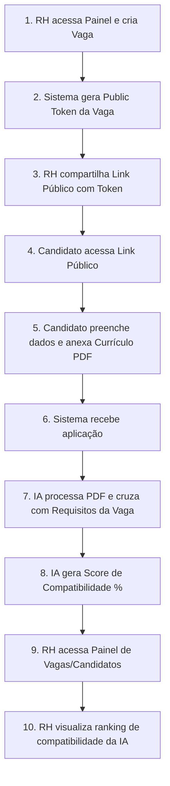

# 🌐 SaaS-RH - Sistema de Gestão de Recursos Humanos

Sistema completo para gerenciamento de processos de recrutamento e seleção focado em automatizar a triagem de candidatos, gerar análises precisas de compatibilidade através de Inteligência Artificial e organizar toda a estrutura da empresa.

<h3>Imagens do Projeto</h3>

<h4>Desktop</h4>
<p>
  
  
  
  
  
  
  
  
  
  
  
  
  
  
  
  
  
  
  
</p>

---

## 🎯 Sobre o Projeto

O **SaaS-RH** é uma plataforma inovadora desenvolvida para revolucionar o setor de Recursos Humanos. Integrando Inteligência Artificial no processo de seleção, o sistema permite:

- **Geração de Vagas com IA**: Criação de descrições de cargos detalhadas a partir de prompts curtos.
- **Análise Automática de Candidatos**: Leitura de currículos (PDF) e cruzamento de dados com a vaga usando IA (OpenAI/Anthropic).
- **Portal do Candidato**: Página pública acessível via token único para o envio fácil de aplicações.
- **Painel Administrativo Completo**: Gestão de empresas, recrutadores, organograma e chat interno.

### 🔄 Fluxo de Recrutamento



**Resumo do Fluxo:**
1. 📝 **Criação da Vaga**: Gestor de RH cria uma vaga (podendo usar IA para gerar a descrição).
2. 🎟️ **Geração de Link**: O sistema gera um `publicToken` seguro exclusivo daquela vaga.
3. 🔗 **Compartilhamento**: O link é publicado em portais ou enviado a candidatos.
4. 📄 **Inscrição**: O candidato acessa o link e faz o upload de seu currículo em PDF.
5. 🧠 **Análise por Inteligência Artificial**: A IA lê o PDF, extrai dados e pontua o candidato com base na descrição da vaga.
6. 🎯 **Triagem Facilitada**: O RH visualiza os candidatos ranqueados pela porcentagem de compatibilidade (Score IA).

---

## ✨ Funcionalidades

### ✅ Implementadas (MVP)

#### Gestão de Vagas & Inteligência Artificial
- ✅ Criação de vagas manuais ou com geração de texto via IA (OpenAI/Anthropic).
- ✅ Geração automática de links públicos (`publicToken`) para inscrição.
- ✅ Leitura e extração de dados de PDFs de currículos.
- ✅ Geração de *Score* de compatibilidade (Match %) do candidato com a vaga.

#### Portal do Candidato
- ✅ Interface pública limpa para inscrição.
- ✅ Validação robusta de formulário com Zod.
- ✅ Upload de currículo.

#### Gestão Organizacional
- ✅ Cadastro de Empresas e Recrutadores.
- ✅ Organograma visual com hierarquias da empresa.
- ✅ Chat interno entre os recrutadores e administradores.
- ✅ Autenticação segura com JWT e hash de senhas (bcrypt).
- ✅ Envio de E-mails transacionais (via Resend).

#### Interface
- ✅ Design responsivo e limpo com TailwindCSS v4.
- ✅ Componentes de UI padronizados e acessíveis via Shadcn UI e Radix.
- ✅ Tabelas de dados dinâmicas e formulários otimizados com React Hook Form.
- ✅ Feedback de sucesso/erro usando Toasts sonoros e visuais.

---

## 🚀 Tecnologias Utilizadas

### Frontend
- **[Next.js 16+](https://nextjs.org/)** - Framework React (App Router).
- **[React 19](https://react.dev/)** - Biblioteca principal de UI.
- **[TypeScript](https://www.typescriptlang.org/)** - Superset tipado do JavaScript.
- **[TailwindCSS v4](https://tailwindcss.com/)** - Framework CSS utilitário.
- **[Zustand](https://zustand-demo.pmnd.rs/)** - Gerenciador de estados globais leve.
- **[React Query (TanStack)](https://tanstack.com/query/latest)** - Cache e sincronização de dados HTTP.
- **[Lucide React](https://lucide.dev/)** - Biblioteca de ícones.
- **[React Hook Form](https://react-hook-form.com/)** - Gerenciamento e validação de forms.
- **[Zod](https://zod.dev/)** - Validação de schemas.

### Backend
- **[Fastify](https://fastify.dev/)** - Framework Node.js de altíssima performance.
- **[Prisma ORM](https://www.prisma.io/)** - Mapeamento objeto-relacional type-safe.
- **[PostgreSQL (Supabase)](https://supabase.com/)** - Banco de dados relacional (Nuven).
- **[AI SDK](https://sdk.vercel.ai/docs)** - Abstração para lidar com OpenAI e Anthropic.
- **[Resend](https://resend.com/)** - Plataforma para envio de E-mails transacionais.
- **[Zod / Type Provider](https://github.com/turkerdev/fastify-type-provider-zod)** - Validação de payloads e responses na API.
- **[bcryptjs](https://www.npmjs.com/package/bcryptjs)** - Hashing de senhas seguro.

---

## 📦 Pré-requisitos

Antes de começar, certifique-se de ter instalado em sua máquina:

- **[Node.js](https://nodejs.org/)** (versão 20.x ou superior)
- **[pnpm](https://pnpm.io/)** (Gerenciador de pacotes recomendado para este projeto)
- **[Git](https://git-scm.com/)**
- Conta no **[Supabase](https://supabase.com/)** (Para instanciar o PostgreSQL na nuvem) ou PostgreSQL local.
- Conta na **OpenAI / Anthropic** e **Resend** (Opcional, mas exigido para os recursos de IA e E-mail funcionarem).

---

## ⚙️ Instalação e Configuração

### 1. Clone o Repositório

```bash
git clone https://github.com/carlosresendeP/envieAgora-SaaS-RH.git
cd envieAgora-SaaS-RH
```

### 2. Configuração do Backend

```bash
cd Backend
pnpm install
```

Crie o arquivo `.env` na pasta `Backend`:

```bash
cp .env.example .env
```

Edite o `.env` gerado:
```env
PORT=3001
NODE_ENV=dev
DATABASE_URL="sua connection string do postgres"
DIRECT_URL="sua connection string direta do postgres (se usar Supabase)"
JWT_SECRET="sua_chave_jwt_super_secreta"
APP_URL=http://localhost:3001/api

OPENAI_API_KEY="sk-SuaChaveOpenAI"
RESEND_API_KEY="re_SuaChaveResend"
EMAIL_FROM=onboarding@resend.dev
```

Configure o Prisma:
```bash
# Sincroniza o banco de dados e gera o Prisma Client
npx prisma migrate dev
npx prisma generate
```

### 3. Configuração do Frontend

Volte para a raiz e acesse a pasta do Frontend:

```bash
cd ../frontend
pnpm install
```

Crie o arquivo `.env.local` na pasta `frontend`:

```bash
cp .env.example .env.local
```

Edite o `.env.local`:
```env
# Apontamento para o seu backend Fastify
NEXT_PUBLIC_API_URL=http://localhost:3001/api
```

---

## 🎮 Como Rodar o Projeto

### Modo Desenvolvimento

Para rodar o projeto, você precisa iniciar os dois servidores (Front e Back) paralelamente.

**No terminal 1 (Backend):**
```bash
cd Backend
pnpm dev
```

**No terminal 2 (Frontend):**
```bash
cd frontend
pnpm dev
```

A aplicação estará disponível em **[http://localhost:3000](http://localhost:3000)**.

### 🚀 Primeiros Passos - Guia Rápido

Após rodar o projeto:

#### 1️⃣ Login Administrativo
1. Acesse: `http://localhost:3000/login`
2. Autentique-se com as credenciais da empresa (Você precisará criar via código ou DB na primeira vez, se não houver um seed configurado).
3. Entre no Dashboard Principal.

#### 2️⃣ Criar uma Vaga com IA
1. Vá até a aba "Vagas" e clique em "Nova Vaga".
2. Selecione a opção para usar a Inteligência Artificial.
3. Digite um prompt (ex: *"Preciso de um dev FullStack com Next.js e Fastify"*).
4. O sistema irá preencher a descrição automaticamente. Salve a vaga.

#### 3️⃣ Publicação e Inscrição
1. A vaga gerada terá um `Public Token`. Pegue a URL pública de inscrição fornecida pelo Dashboard.
2. Abra essa URL em uma janela anônima. Você verá o portal do Candidato.
3. Preencha seus dados de teste e faça o Upload de um PDF real (currículo).
4. Envie a candidatura.

#### 4️⃣ Verificando Análise da IA
1. Retorne para a janela de Admin.
2. Acesse a Vaga criada e veja os candidatos aplicados.
3. Observe o "Score" (compatibilidade em %) e a resenha textual que a Inteligência Artificial gerou lendo o PDF enviado versus a descrição da Vaga.

### Modo Produção (Build)

**Backend:**
```bash
npm run build
npm start
```

**Frontend:**
```bash
npm run build
npm start
```

### Rodar o Prisma Studio

Para editar os dados do banco usando uma interface visual:
```bash
cd Backend
npx prisma studio
```
O Prisma Studio estará em **[http://localhost:5555](http://localhost:5555)**.

---

## 📁 Estrutura do Projeto

O projeto é um **Monorepo** não acoplado fisicamente (pastas separadas).

```
saas-rh/
├── Backend/                      # API Fastify
│   ├── prisma/                   # Schema do banco de dados (schema.prisma)
│   ├── src/
│   │   ├── Ai/                   # Serviços de comunicação com OpenAI/Anthropic
│   │   ├── config/               # Setup de Env e libs
│   │   ├── controllers/          # Controladores (recebem as rotas HTTP)
│   │   ├── middleware/           # Middlewares de Autenticação/Segurança
│   │   ├── Routes/               # Definições de Endpoints
│   │   ├── schemas/              # Tipagem e validações Zod reutilizáveis
│   │   ├── services/             # Lógica de banco (Prisma) e regras de negócio
│   │   ├── app.ts                # Inicialização do Fastify
│   │   └── server.ts             # Entry point de Listen na porta
│   └── package.json
│
└── frontend/                     # Aplicação Next.js (App Router)
    ├── app/                      # Rotas de páginas (/login, /dashboard, etc)
    ├── components/               # Componentes React reutilizáveis e Shadcn UI
    ├── hooks/                    # Lógicas locais extraídas (React Hooks)
    ├── lib/                      # Zod Validations, utils
    ├── public/                   # Imagens e ícones
    ├── services/                 # Clientes Axios para consumir o Backend
    ├── store/                    # Arquivos do Zustand para estado global
    ├── next.config.ts            # Configurações do framework
    ├── tailwind.config.ts        # Setup de temas, cores e bordas
    └── package.json              # Dependências
```

---

## 🔌 APIs Disponíveis

Uma visão geral das rotas primárias expostas no servidor Fastify. (Documentação completa via Swagger/Postman recomendada).

### Autenticação

- `POST /api/auth/login` - Valida e-mail/senha, retorna JWT Auth e dados de Sessão.
- `POST /api/auth/register` - Registro inicial de uma nova companhia/gestor.

### Vagas

- `POST /api/vagas` - Cria uma nova vaga.
- `POST /api/vagas/ai/generate` - Solicita à IA a descrição formatada de uma vaga baseada num input simples.
- `GET /api/vagas` - Retorna a lista de vagas da empresa logada.
- `GET /api/vagas/:id` - Retorna detalhes de uma vaga específica.

### Candidatos

- `GET /api/candidatos/public-token/:token` - Valida se o Token público da vaga existe para abrir o formulário do candidato.
- `POST /api/candidatos` - Rota pública para submeter formulário (FormData) com currículo (PDF).
- `POST /api/candidatos/analyze/:id` - Inicia a análise da IA de um candidato em relação a vaga.

### Notificações & Emails

- `POST /api/emails/send` - Dispara envios utilizando a API do Resend.

---

## 🔐 Variáveis de Ambiente

### Backend (`Backend/.env`)

| Variável | Descrição | Obrigatória | Exemplo |
|----------|-----------|-------------|---------|
| `PORT` | Porta de acesso API | ✅ Sim | `3001` |
| `NODE_ENV` | Modo da API | ✅ Sim | `dev` |
| `DATABASE_URL` | Connection String do DB | ✅ Sim | `postgresql://...` |
| `JWT_SECRET` | Secret hash para os tokens | ✅ Sim | `Secreta123!` |
| `APP_URL` | URL da API | ✅ Sim | `http://localhost:3001/api` |
| `OPENAI_API_KEY`| Token da OpenAI | ❌ Não (Opcional) | `-...` |
| `RESEND_API_KEY`| Token do Resend Mailer | ❌ Não (Opcional) | `...` |

### Frontend (`frontend/.env.local`)

| Variável | Descrição | Obrigatória | Exemplo |
|----------|-----------|-------------|---------|
| `NEXT_PUBLIC_API_URL`| Endpoint base onde as chamadas do Axios baterão. | ✅ Sim | `http://localhost:3001/api` |

---

## 🌐 Deploy

### Deploy do Frontend (Recomendado: Vercel)

A plataforma **Vercel** é ideal, visto que o Frontend utiliza Next.js.
1. Suba o código para o GitHub.
2. Importe o repositório na Vercel e especifique o "Root Directory" como `frontend`.
3. Defina a variável de ambiente `NEXT_PUBLIC_API_URL` apontando para o seu backend já publicado.
4. Execute o Deploy. O App Router lidará perfeitamente com Server Components e otimizações de imagem automaticamente.

### Deploy do Backend (Recomendado: Render / Railway / Docker VPS)

Como trata-se de um servidor Node.js/Fastify isolado:
1. Conecte sua branch de produção à plataforma em nuvem (Ex: Render).
2. Configure o "Root Directory" como `Backend`.
3. Comando de build: `pnpm run build`
4. Comando de início: `pnpm start`
5. Adicione **todas** as variáveis de ambiente necessárias via painel da cloud host e assegure-se de que a instância do banco de dados (Supabase ou afins) esteja autorizada a receber as conexões IP.

---

## 📚 Documentação Adicional

- **[Next.js App Router Docs](https://nextjs.org/docs/app)**
- **[Fastify Route Documentation](https://fastify.dev/docs/latest/Reference/Routes/)**
- **[Prisma ORM Referência](https://www.prisma.io/docs)**
- **[TailwindCSS v4](https://tailwindcss.com/docs/installation)**
- **[Vercel AI SDK (OpenAI/Anthropic)](https://sdk.vercel.ai/docs)**

---

## 🛠️ Scripts Disponíveis

### Em `Backend/`
```bash
pnpm dev        # Inicia API com hot-reload usando tsx
pnpm build      # Transpila projeto TS -> JS
pnpm start      # Roda API em modo produção
```

### Em `frontend/`
```bash
pnpm dev        # Inicia front em modo de desenvolvimento
pnpm build      # Build otimizado do Next.js
pnpm start      # Roda o Server (SSR) de produção Next.js
pnpm lint       # Valida codebase (ESLint)
```

---

## 👨💻 Autor

**Carlos Paula**

---

**Versão**: 1.0.0  
