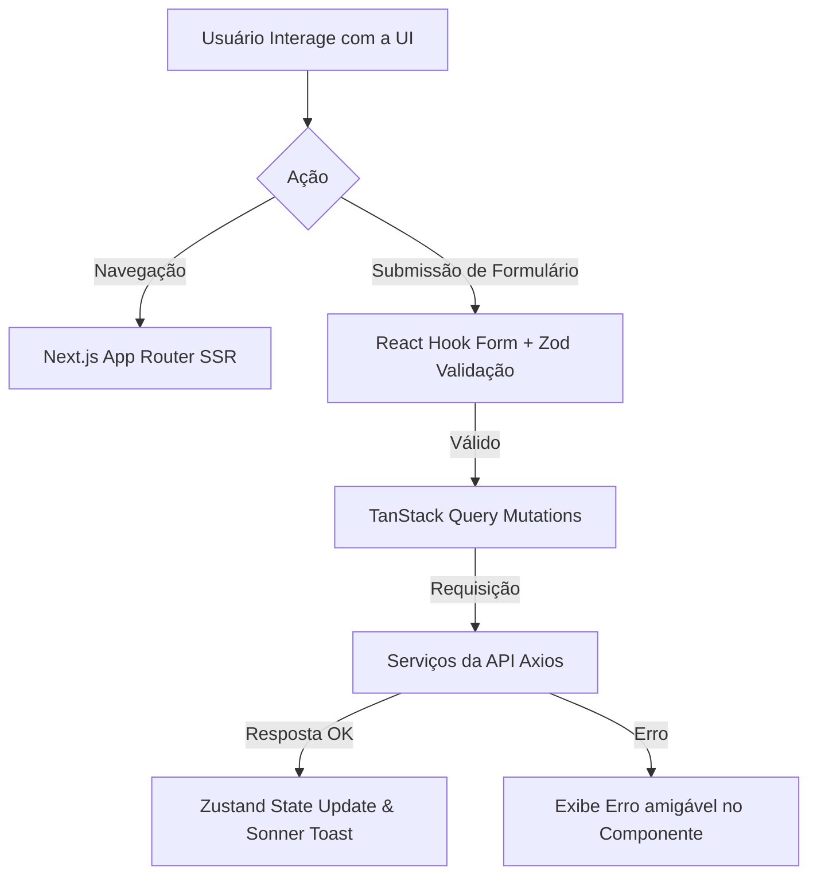

# 🎨 SaaS-RH - Frontend Application

Este é o repositório **Frontend** do projeto SaaS-RH. Ele foi desenvolvido com as mais modernas tecnologias do ecossistema React, com foco absoluto em performance, SEO e Experiência do Usuário (UX). Aqui, gestores de RH gerenciam vagas, e os candidatos realizam suas inscrições em uma interface altamente responsiva e acessível.

<h3>Imagens da Interface</h3>

<h4>Desktop</h4>
<p>
  
  
  
  
  
</p>

---

## 🎯 Sobre o Frontend

A aplicação client-side atua de forma totalmente independente do backend, comunicando-se via API REST. Para entregar uma interface sofisticada e sem atrasos, adotamos a estratégia do App Router do Next.js (SSR/SSG). 

### 🔄 Arquitetura e Fluxo de Dados (Frontend)



**Explicação do Fluxo:**
1. 🖥️ **Navegação**: A arquitetura App Router mapeia URLs para componentes server-side primeiro, entregando HTML limpo e rápido para SEO.
2. 📝 **Formulários Seguros**: Interações de input são gerenciadas pelo React Hook Form, evitando re-renderizações desnecessárias. O Zod bloqueia dados inválidos imediatamente.
3. ☁️ **Fetch & Cache**: O TanStack Query (React Query) aciona as APIs usando Axios, guardando as requisições em cache. Se a mesma aba solicitar os mesmos dados, a tela não tem _loading_ (Cache First).
4. 🌍 **Estado Global**: Para gerir temas (Dark/Light mode) ou sessão do usuário na máquina, usamos Zustand, uma alternativa leve e flexível ao Context API.

---

## 🚀 Tecnologias e Ferramentas

Esta arquitetura adota referências sólidas da indústria (clique nos links para acessar as documentações oficiais):

- **[Next.js (v16+)](https://nextjs.org/)** - O framework React otimizado com App Router, SSR e Server Components.
- **[React.js (v19)](https://react.dev/)** - Biblioteca base construindo interfaces compostas por componentes independentes.
- **[Tailwind CSS (v4)](https://tailwindcss.com/)** - Framework CSS Utility-First. Flexibilidade com extrema otimização no build.
- **[Shadcn UI](https://ui.shadcn.com/)** - Uma coleção de componentes Radix projetada para total acessibilidade e beleza. O código do componente passa a fazer parte do seu projeto.
- **[React Hook Form](https://react-hook-form.com/)** - Gerenciador de estados de formulário altamente performático.
- **[Zod](https://zod.dev/)** - Declaração de Schema com integração nativa no Hook Form via `@hookform/resolvers`.
- **[TanStack Query](https://tanstack.com/query/latest)** - Lida de forma majestosa com requisições, retentativas e stale data cache.
- **[Zustand](https://zustand-demo.pmnd.rs/)** - Um "urso" pequeno, rápido e flexível para gerenciar o estado global da UI.
- **[Lucide React](https://lucide.dev/)** - Suíte de ícones open-source e customizáveis.

---

## 📦 Pré-requisitos

Certifique-se de que sua máquina atende aos requisitos básicos:

- **[Node.js](https://nodejs.org/)** (v20+)
- **[pnpm](https://pnpm.io/)** (O projeto utiliza estritamente o `pnpm` para a resolução e cache de dependências)
- **Backend rodando** - O Backend na porta 3001 deve estar operante para prover as informações.

---

## ⚙️ Instalação e Configuração

### 1. Instale as Dependências

Na raiz da pasta do frontend, execute:

```bash
cd frontend
pnpm install
```

### 2. Configure as Variáveis de Ambiente (`.env.local`)

Crie o arquivo contendo os links públicos de comunicação entre o Front e o Back, além do link principal da aplicação.

```bash
cp .env.example .env.local
```

Abra o arquivo `.env.local` e configure:

```env
# Exemplo de configuração do frontend

# URL da API local ou em Produção
NEXT_PUBLIC_API_URL="your Key"

# URL Front end
NEXT_PUBLIC_SITE_URL="your Key"
```
> **Nota de Segurança**: No Next.js, as chaves não precedidas por `NEXT_PUBLIC_` só estarão disponíveis para o Server Component. O prefixo expõe a URL para o cliente (navegador).

---

## 🎮 Como Rodar o Projeto

### Modo de Desenvolvimento

```bash
pnpm dev
```
O servidor de desenvolvimento do Next.js iniciará no endereço `http://localhost:3000`. Acesse e desenvolva com Hot Reload ativado nativamente.

### Modo de Produção

O Next.js exige uma etapa de build severa que gera páginas estáticas sempre que possível, tornando o App super veloz.

```bash
# 1. Faz a compilação de toda a aplicação (Assets, Server Actions, Tipagens)
pnpm build

# 2. Inicia o servidor Node otimizado em porta local
pnpm start
```

---

## 📁 Estrutura de Pastas

Organizamos a estrutura para suportar a escala do produto e facilitar a busca:

```
frontend/
├── src/
│   ├── app/                # Next.js App Router (Páginas, Layouts, API Routes)
│   ├── components/         # Componentes React
│   │   ├── ui/             # Componentes base do Shadcn UI
│   │   ├── layout/         # Header, Sidebar, Footer...
│   │   └── forms/          # Componentes relacionados a validações React Hook Form
│   ├── hooks/              # Custom Hooks globais
│   ├── lib/                # Configurações do Axios, utilitários globais
│   ├── validations/        # Arquivos de Schema Zod correspondentes para tipagem
│   └── store/              # Arquivos Zustand
├── public/                 # Imagens estáticas e print screens
├── tailwind.config.ts      # Tokens de design do projeto
└── package.json            # Dependências geridas pelo pnpm
```

---

## 🛠️ Scripts Padrões (Package.json)

Dentro do diretório `/frontend`, utilize o **pnpm** para os seguintes comandos vitais:

| Comando | Execução |
|---------|----------|
| `pnpm dev` | Abre o FrontEnd em ambiente de desenvolvimento (localhost:3000). |
| `pnpm build` | Gera versão otimizada da UI (cria o `.next`). |
| `pnpm start` | Entrega ao browser os arquivos do build (emulação de produção). |
| `pnpm lint` | Checa problemas de sintaxe no código segundo o ESLint em todo o React. |

---

## 👨💻 Autor

**Carlos Paula**

---

**Versão**: 1.0.0  
**Stack**: Full TypeScript (Next.js)
